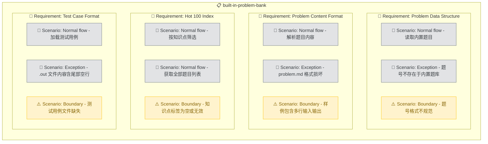

# Built-in Problem Bank

## Purpose

提供完整的 LeetCode Hot 100 内置题库，使 ACM 训练 Skill 能在离线环境下直接出题。每道题目以 ACM 格式存储，包含题面、输入输出格式、样例、数据范围和测试用例。系统 SHALL 根据题号或知识点快速检索题目，为随机测验、专项练习、代码评判等模块提供统一的数据源。内置题库消除了对网络的依赖，保证训练体验的即时性和稳定性。

<!-- DIAGRAM:flowchart -->

## Requirements

### Requirement: Problem Data Structure
系统 SHALL 以目录结构存储每道题目，每个题目目录包含 `problem.md`（ACM 格式题面）和 `tests/` 子目录（测试用例文件对）。题目目录命名格式为 `<三位数题号>-<英文短名>`，如 `001-two-sum`、`015-3sum`。每道题 MUST 包含至少 3 组测试用例（基础用例、边界用例、随机用例），每组由 `.in`（输入）和 `.out`（预期输出）文件对组成。

#### Scenario: Normal flow - 读取内置题目
Given 内置题库中存在题目 `001-two-sum`
When Skill 通过题号 `1` 检索题目
Then 返回该题目的 ACM 格式题面和全部测试用例路径

#### Scenario: Exception - 题号不存在于内置题库
Given 内置题库中不存在题号 `9999`
When Skill 通过题号 `9999` 检索题目
Then 返回"未找到内置题目"提示，并建议用户使用 `/acm fetch 9999` 在线获取

#### Scenario: Boundary - 题号格式不规范
Given 用户输入题号为 `1`（非三位数）
When Skill 检索题目
Then 自动补零匹配 `001-two-sum` 目录并正确返回

### Requirement: Problem Content Format
每道题的 `problem.md` SHALL 使用统一的 ACM 格式，包含以下结构化段落：题目名称与元信息（题号、难度、知识点、输入模式）、题目描述、输入格式、输出格式、样例（至少 1 组输入输出示例）、数据范围（约束条件）。元信息 MUST 标注该题对应的 ACM 输入模式类型（basic/multi_case/matrix/graph/tree/fast_io），以便自动关联模板。

#### Scenario: Normal flow - 解析题目内容
Given 题目 `070-climbing-stairs` 的 `problem.md` 存在且格式正确
When Skill 读取该文件
Then 成功提取题号、难度、知识点、输入模式、题目描述、输入输出格式、样例、数据范围

#### Scenario: Exception - problem.md 格式损坏
Given 某题目的 `problem.md` 缺少"输入格式"段落
When Skill 读取该文件
Then 返回格式校验错误，指出缺少的段落名称

#### Scenario: Boundary - 样例包含多行输入输出
Given 题目 `200-number-of-islands` 的样例需要矩阵输入
When Skill 解析样例
Then 正确处理多行输入输出，保持换行符和空格的精确匹配

### Requirement: Hot 100 Index
系统 SHALL 维护一个 Hot 100 题目索引文件 `problems/index.json`，记录每道题的题号、标题、难度、知识点标签、输入模式类型和目录路径。索引 MUST 支持按知识点标签筛选题目列表，用于随机测验和分类练习。

#### Scenario: Normal flow - 按知识点筛选
Given 索引中包含 15 道"动态规划"标签的题目
When Skill 请求知识点为"动态规划"的题目列表
Then 返回这 15 道题目的完整信息

#### Scenario: Normal flow - 获取全部题目列表
Given 索引中包含 100 道题目
When Skill 请求全部题目列表
Then 返回全部 100 道题目的摘要信息

#### Scenario: Boundary - 知识点标签为空或无效
Given 用户请求知识点为"量子计算"的题目
When Skill 查询索引
Then 返回空列表并提示可用的知识点标签列表

### Requirement: Test Case Format
每组测试用例 SHALL 以纯文本文件对存储：`.in` 文件包含标准输入内容，`.out` 文件包含预期标准输出内容。文件名前缀标识用例类型（`basic`/`edge`/`random`/`special`）。.out 文件 MUST 精确匹配评判预期，包括换行符，不允许尾部多余空格或空行。

#### Scenario: Normal flow - 加载测试用例
Given 题目 `001-two-sum` 有 4 组测试用例
When 评判引擎请求该题目的测试用例
Then 返回 4 组 `.in`/`.out` 文件对及其类型标签

#### Scenario: Exception - .out 文件内容含尾部空行
Given 某测试用例的 `.out` 文件末尾有多余空行
When 评判引擎读取该文件
Then 自动 trim 尾部空白行，确保与程序输出精确对比

#### Scenario: Boundary - 测试用例文件缺失
Given 题目目录下有 `01-basic.in` 但缺少 `01-basic.out`
When 评判引擎加载测试用例
Then 跳过该不完整的用例对，记录警告信息
