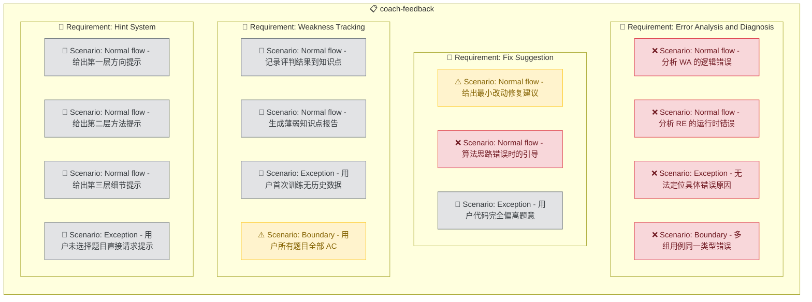

# Coach Feedback

## Purpose

提供教练反馈功能，在用户代码评判后自动分析错误原因、定位问题代码行、给出具体修复建议，并跟踪用户的薄弱知识点。教练反馈以自然语言形式输出，帮助用户理解为什么错、怎么改、下次如何避免，而不仅仅告知对错。教练反馈是 Skill（AI）驱动的核心模块，体现"教练"角色的价值，直接影响用户的学习效果和训练动力。

<!-- DIAGRAM:flowchart -->

## Requirements

### Requirement: Error Analysis and Diagnosis
系统 SHALL 在评判结果为 WA 或 RE 时，自动分析错误原因。分析内容 MUST 包括：错误类型分类（逻辑错误、边界遗漏、格式错误、类型错误等）、问题代码的行级定位、错误原因的自然语言解释。对于 WA，系统 SHALL 对比预期输出和实际输出，推断最可能的错误模式（如 off-by-one、未处理空输入、输出格式错误）。

#### Scenario: Normal flow - 分析 WA 的逻辑错误
Given 用户代码在边界用例（n=1）上判定 WA，预期输出 1，实际输出 0
When 教练分析错误
Then 定位到代码第 8 行循环起始条件 `for i in range(1, n)` 在 n=1 时不执行，解释"边界遗漏：循环从 1 开始导致 n=1 时跳过"，建议改为 `range(n)`

#### Scenario: Normal flow - 分析 RE 的运行时错误
Given 用户代码在第 2 组用例判定 RE，stderr 包含 `IndexError: list index out of range`
When 教练分析错误
Then 解释"数组越界：访问了不存在的索引"，定位到出错的代码行，建议添加边界检查

#### Scenario: Exception - 无法定位具体错误原因
Given 用户代码输出与预期差异较大，且无明显规律
When 教练分析错误
Then 坦诚说明"当前难以精确定位问题"，提供可能的排查方向列表（检查算法思路、验证中间结果、打印调试），建议用户先尝试手动模拟

#### Scenario: Boundary - 多组用例同一类型错误
Given 用户代码在 3 组用例上全部 WA，错误模式一致（均为 off-by-one）
When 教练分析错误
Then 归纳为同一个根因问题，只解释一次，而非重复三次相同分析

### Requirement: Fix Suggestion
系统 SHALL 在错误分析后，给出具体的修复建议。修复建议 MUST 包含：修改方向描述、修改后的代码片段示例（标注改动的关键行）。修复建议 SHALL 逐步引导，优先给出最小改动方案，而非直接给出完整正确答案。

#### Scenario: Normal flow - 给出最小改动修复建议
Given 用户代码在排序比较时使用了 `>` 而非 `>=`
When 教练给出修复建议
Then 提示"将第 12 行的 `>` 改为 `>=` 即可处理相等情况"，附带修改后的代码片段

#### Scenario: Normal flow - 算法思路错误时的引导
Given 用户使用了暴力解法导致 TLE
When 教练给出修复建议
Then 不直接给正确代码，而是提示"暴力解法时间复杂度 O(n²) 超时，考虑使用哈希表优化到 O(n)"，给出优化思路而非完整答案

#### Scenario: Exception - 用户代码完全偏离题意
Given 用户代码的算法思路与题目要求无关
When 教练给出修复建议
Then 直接指出"当前解法与题目要求不符"，重新解释题目要求的核心逻辑，建议从零开始重写并给出代码骨架

### Requirement: Weakness Tracking
系统 SHALL 根据用户的评判历史，跟踪和统计薄弱知识点。每次评判完成后，系统 MUST 更新该题对应知识点的通过/失败记录。当用户请求时，系统 SHALL 输出薄弱知识点报告，按错误率从高到低排列，并推荐针对性的练习题目。

#### Scenario: Normal flow - 记录评判结果到知识点
Given 用户完成题目"322.零钱兑换"（知识点：动态规划），判定 WA
When 系统更新训练记录
Then "动态规划"知识点下新增一条失败记录，累计统计更新

#### Scenario: Normal flow - 生成薄弱知识点报告
Given 用户已完成 20 道题，其中"双指针"类题目 5 道仅通过 1 道（通过率 20%）
When 用户请求薄弱知识点报告
Then 报告中"双指针"排在前列，标注通过率 20%（1/5），推荐 2-3 道双指针专项练习题

#### Scenario: Exception - 用户首次训练无历史数据
Given 用户从未做过任何题目
When 用户请求薄弱知识点报告
Then 提示"暂无训练记录，完成几道题后即可生成分析报告"，并推荐从 Phase 1 入门题目开始

#### Scenario: Boundary - 用户所有题目全部 AC
Given 用户完成 15 道题，全部 AC
When 用户请求薄弱知识点报告
Then 提示"目前表现优秀，全部通过！"，建议尝试更高难度的题目或参加模拟赛

### Requirement: Hint System
系统 SHALL 在用户请求提示时（`/acm hint`），根据当前题目和用户的进度给出渐进式提示。提示分为三个层级：方向提示（提示用什么算法/数据结构）、方法提示（提示关键步骤或公式）、细节提示（给出接近答案的代码片段）。每次只给出一个层级的提示，用户可逐步请求更深入的提示。

#### Scenario: Normal flow - 给出第一层方向提示
Given 用户在做"200.岛屿数量"，请求第一次提示
When 教练给出提示
Then 提示"这道题可以用 BFS 或 DFS 遍历网格，将连通的区域标记为已访问"，不暴露具体代码

#### Scenario: Normal flow - 给出第二层方法提示
Given 用户已获得第一层提示，仍卡住，请求第二次提示
When 教练给出提示
Then 提示"从每个未被访问的 '1' 开始 BFS，将相邻的 '1' 都标记为已访问，每启动一次 BFS 就是一个岛屿"，比上一层更具体但仍无代码

#### Scenario: Normal flow - 给出第三层细节提示
Given 用户已获得前两层提示，仍无法解决，请求第三次提示
When 教练给出提示
Then 提供关键代码片段：BFS 遍历邻居的循环结构，标注核心逻辑但保留部分 TODO

#### Scenario: Exception - 用户未选择题目直接请求提示
Given 用户没有当前正在做的题目
When 用户输入 `/acm hint`
Then 提示"请先选择一道题目：使用 /acm quiz 或 /acm practice <题号> 开始练习"
