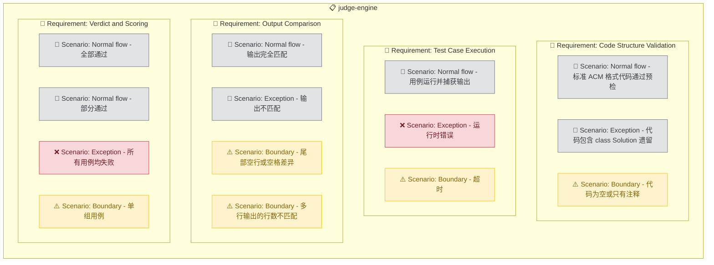

# Judge Engine

## Purpose

提供确定性的代码评判引擎，对用户提交的 ACM 格式 Python 代码进行自动化评判。引擎通过管道输入测试用例、捕获程序输出、与预期输出精确对比，逐用例判定 AC/WA/RE/TLE/CE 并计算总分。评判引擎以独立可执行脚本形式运行，确保评判结果的确定性和可重复性，不受 AI 不确定性影响。引擎是整个 ACM 训练 Skill 的核心体验环节，直接决定训练反馈的准确性。

<!-- DIAGRAM:flowchart -->

## Requirements

### Requirement: Code Structure Validation
评判引擎 SHALL 在运行测试用例前，先检查用户提交的代码结构是否符合 ACM 格式。检查项包括：是否包含 `input()` 或 `sys.stdin` 读取输入、是否包含 `print()` 或 `sys.stdout` 输出结果、是否遗留 `class Solution`（LeetCode 遗留）、是否在主流程中使用 `return` 而非 `print`。检查结果 MUST 作为预检报告输出，不阻止后续评判流程。

#### Scenario: Normal flow - 标准 ACM 格式代码通过预检
Given 用户提交的代码包含 `input()` 读取和 `print()` 输出，无 `class Solution`
When 评判引擎执行代码结构检查
Then 预检报告显示全部通过，继续进入测试用例评判

#### Scenario: Exception - 代码包含 class Solution 遗留
Given 用户提交的代码中包含 `class Solution:` 和 `def twoSum(self, ...)` 结构
When 评判引擎执行代码结构检查
Then 预检报告标记"LeetCode 格式残留"警告，提示用户将 class 改为顶层代码，仍继续评判流程

#### Scenario: Boundary - 代码为空或只有注释
Given 用户提交的代码文件为空或仅包含注释行
When 评判引擎执行代码结构检查
Then 预检报告标记"代码为空"错误，所有用例直接判定 CE，总分 0

### Requirement: Test Case Execution
评判引擎 SHALL 对每组测试用例执行以下流程：将 `.in` 文件内容通过 stdin 管道输入到用户的 Python 代码中，捕获 stdout 输出，设置超时时间限制（默认 5 秒），收集实际输出和退出码。每组用例 MUST 独立运行，互不影响。

#### Scenario: Normal flow - 用例运行并捕获输出
Given 题目有 5 组测试用例，用户代码逻辑正确
When 评判引擎逐组执行 `cat input.in | python solution.py`
Then 5 组用例全部捕获到 stdout 输出，退出码均为 0

#### Scenario: Exception - 运行时错误
Given 用户代码在第 3 组用例中出现除零错误
When 评判引擎执行该组用例
Then 该用例判定 RE，捕获 stderr 中的异常信息（如 `ZeroDivisionError: division by zero`），其余用例继续运行

#### Scenario: Boundary - 超时
Given 用户代码包含死循环，5 秒内未结束
When 评判引擎执行该组用例
Then 该用例判定 TLE，强制终止进程，记录超时秒数，其余用例继续运行

### Requirement: Output Comparison
评判引擎 SHALL 将用户程序的实际输出与 `.out` 文件中的预期输出进行精确对比。对比规则：先对双方按行 split 再逐行 trim 首尾空白后对比，消除平台换行符差异（CRLF vs LF）。若所有行完全匹配则判定 AC，否则判定 WA 并输出差异对比（显示第一个不匹配行的行号、预期内容和实际内容）。

#### Scenario: Normal flow - 输出完全匹配
Given 预期输出为 `15`，用户程序输出为 `15`
When 评判引擎对比输出
Then 判定 AC，该用例得分

#### Scenario: Exception - 输出不匹配
Given 预期输出为 `[0, 1]`，用户程序输出为 `[1, 0]`（顺序错误）
When 评判引擎对比输出
Then 判定 WA，显示差异：第 1 行预期 `[0, 1]` 实际 `[1, 0]`

#### Scenario: Boundary - 尾部空行或空格差异
Given 预期输出末尾有一个空行，用户输出末尾无空行
When 评判引擎对比输出（trim 模式）
Then 判定 AC，因为 trim 后内容一致

#### Scenario: Boundary - 多行输出的行数不匹配
Given 预期输出 3 行，用户输出 2 行
When 评判引擎对比输出
Then 判定 WA，显示第 3 行缺失，预期内容为 xxx，实际为空

### Requirement: Verdict and Scoring
评判引擎 SHALL 为每组测试用例给出判定结果（AC/WA/RE/TLE/CE），并计算总分。每道题的测试用例等权分配分数（100 分 / 用例总数），总分等于通过用例的分数之和。评判结果 MUST 以结构化格式输出，包含每道题的总分、通过率、逐用例详情。

#### Scenario: Normal flow - 全部通过
Given 题目有 5 组用例，全部判定 AC
When 评判引擎计算总分
Then 总分 100/100，通过率 5/5

#### Scenario: Normal flow - 部分通过
Given 题目有 5 组用例，3 组 AC、1 组 WA、1 组 RE
When 评判引擎计算总分
Then 总分 60/100，通过率 3/5，详细列出每组的判定和错误信息

#### Scenario: Exception - 所有用例均失败
Given 题目有 4 组用例，全部判定 WA
When 评判引擎计算总分
Then 总分 0/100，通过率 0/4，输出每组 WA 的差异对比

#### Scenario: Boundary - 单组用例
Given 题目只有 1 组测试用例且判定 AC
When 评判引擎计算总分
Then 总分 100/100，通过率 1/1
