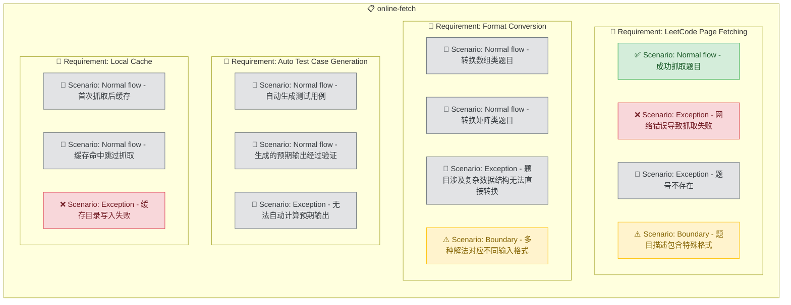

# Online Fetch

## Purpose

提供在线抓取功能，当用户请求的题号不在内置题库中时，通过抓取力扣网页获取原题信息，由 AI 将 LeetCode 格式转换为 ACM 格式题面，并自动生成测试用例。转换完成后，题目数据缓存到本地，后续请求直接从本地读取，避免重复抓取。此模块作为内置题库的补充，确保用户可以练习任意力扣题目，不受内置 100 题的限制。

<!-- DIAGRAM:flowchart -->

## Requirements

### Requirement: LeetCode Page Fetching
系统 SHALL 在用户请求的题号未命中内置题库时，通过 web 工具抓取力扣题目页面。抓取 MUST 提取以下信息：题目标题、难度、描述正文、示例（输入输出）、约束条件（数据范围）。系统 SHALL 处理抓取失败的情况（网络错误、页面不存在、反爬限制），给出清晰的错误提示。

#### Scenario: Normal flow - 成功抓取题目
Given 用户请求题号 `234`（回文链表），内置题库中不存在
When 系统抓取力扣题目页面
Then 成功提取标题、难度、描述、示例和约束条件

#### Scenario: Exception - 网络错误导致抓取失败
Given 用户请求题号 `567`，但网络不可用
When 系统尝试抓取
Then 提示"网络错误，无法获取题目。请检查网络连接或稍后重试"

#### Scenario: Exception - 题号不存在
Given 用户请求题号 `99999`
When 系统尝试抓取
Then 提示"题号 99999 不存在，请确认题号是否正确"

#### Scenario: Boundary - 题目描述包含特殊格式
Given 题号 `23`（合并 K 个升序链表）的描述包含复杂的嵌套列表和数学符号
When 系统抓取并解析
Then 正确保留所有格式信息，包括嵌套列表、数学符号和代码片段

### Requirement: Format Conversion
系统 SHALL 将抓取到的 LeetCode 格式题目转换为 ACM 格式。转换 MUST 包括：将函数参数描述转换为 stdin 输入格式说明、将 return 值描述转换为 stdout 输出格式说明、将示例重新组织为 ACM 样例格式（输入块 + 输出块）、添加数据范围约束。转换后的题面 SHALL 使用与内置题库统一的格式，便于 Skill 解析和模板关联。

#### Scenario: Normal flow - 转换数组类题目
Given 抓取到 LeetCode 题目 `def twoSum(self, nums: List[int], target: int) -> List[int]`
When AI 执行格式转换
Then 生成 ACM 输入格式："第一行输入整数 n，第二行输入 n 个整数，第三行输入整数 target"，输出格式："输出两个整数（空格分隔）"

#### Scenario: Normal flow - 转换矩阵类题目
Given 抓取到 LeetCode 题目 `def numIslands(self, grid: List[List[str]]) -> int`
When AI 执行格式转换
Then 生成 ACM 输入格式："第一行输入整数 m 和 n，接下来 m 行每行 n 个字符（0 或 1）"

#### Scenario: Exception - 题目涉及复杂数据结构无法直接转换
Given 题目涉及 `TreeNode` 或 `ListNode` 等 LeetCode 自定义结构（如二叉树序列化）
When AI 执行格式转换
Then 给出替代的 ACM 输入方案（如树用层序遍历数组表示、链表用数组表示），并在题面中明确说明转换规则

#### Scenario: Boundary - 多种解法对应不同输入格式
Given 题目可以用多种方式描述输入（如边列表或邻接矩阵）
When AI 执行格式转换
Then 选择最常见且直观的输入格式，在题面中明确说明

### Requirement: Auto Test Case Generation
系统 SHALL 在格式转换完成后，根据题目描述自动生成至少 3 组测试用例（基础用例、边界用例、随机用例）。测试用例 MUST 以 `.in`/`.out` 文件对形式保存到题目目录中。生成的用例 SHALL 与内置题库的格式完全一致，便于评判引擎直接使用。

#### Scenario: Normal flow - 自动生成测试用例
Given 题目"两数之和"已完成格式转换
When 系统自动生成测试用例
Then 生成至少 3 组 .in/.out 文件对：基础用例（题目示例）、边界用例（n=2 最小长度）、随机用例（中等规模数组）

#### Scenario: Normal flow - 生成的预期输出经过验证
Given 系统为"爬楼梯"生成了一组随机输入 n=10
When 系统计算预期输出
Then 预期输出为正确的 89（fib(11)），通过已知算法验证而非依赖 AI 猜测

#### Scenario: Exception - 无法自动计算预期输出
Given 题目过于复杂，AI 无法确定性地计算出预期输出
When 系统生成测试用例
Then 标记该用例为"待验证"，提示用户确认预期输出，或仅保留题目示例作为确定性用例

### Requirement: Local Cache
系统 SHALL 将在线抓取并转换完成的题目数据缓存到本地 `problems/` 目录中，使用与内置题库相同的目录结构（`<题号>-<短名>/problem.md` + `tests/`）。后续对同一题号的请求 SHALL 直接从本地缓存读取，不再重复抓取。缓存 MUST 包含来源标记（`source: online-fetch`），以区分内置题目和在线获取的题目。

#### Scenario: Normal flow - 首次抓取后缓存
Given 用户首次请求题号 `234`
When 系统完成抓取、转换、生成用例
Then 题目数据保存到 `problems/234-palindrome-linked-list/` 目录，后续请求直接读取本地

#### Scenario: Normal flow - 缓存命中跳过抓取
Given 题号 `234` 已缓存到本地
When 用户再次请求题号 `234`
Then 直接返回缓存的 ACM 格式题面，不发起网络请求

#### Scenario: Exception - 缓存目录写入失败
Given 磁盘空间不足或权限问题导致无法写入缓存
When 系统尝试保存题目数据
Then 题目仍正常展示给用户，提示"缓存保存失败，下次仍需在线获取"
