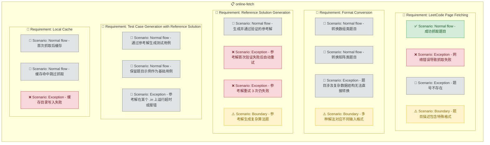

# Online Fetch

## Purpose

提供在线抓取功能，当用户请求的题号不在内置题库中时，通过抓取力扣网页获取原题信息，由 AI 将 LeetCode 格式转换为 ACM 格式题面，并自动生成参考解和测试用例。测试用例的预期输出由参考解运行产生，确保正确性而非依赖 AI 猜测。转换完成后，题目数据缓存到本地，后续请求直接从本地读取，避免重复抓取。此模块作为内置题库的补充，确保用户可以练习任意力扣题目，不受内置 100 题的限制。

<!-- DIAGRAM:flowchart -->

## Requirements

### Requirement: LeetCode Page Fetching
系统 SHALL 在用户请求的题号未命中内置题库时，通过 web 工具抓取力扣题目页面。抓取 MUST 提取以下信息：题目标题、难度、描述正文、示例（输入输出）、约束条件（数据范围）。系统 SHALL 处理抓取失败的情况（网络错误、页面不存在、反爬限制），给出清晰的错误提示。

#### Scenario: Normal flow - 成功抓取题目
Given 用户请求题号 `234`（回文链表），内置题库中不存在
When 系统抓取力扣题目页面
Then 成功提取标题、难度、描述、示例和约束条件

#### Scenario: Exception - 网络错误导致抓取失败
Given 用户请求题号 `567`，但网络不可用
When 系统尝试抓取
Then 提示"网络错误，无法获取题目。请检查网络连接或稍后重试"

#### Scenario: Exception - 题号不存在
Given 用户请求题号 `99999`
When 系统尝试抓取
Then 提示"题号 99999 不存在，请确认题号是否正确"

#### Scenario: Boundary - 题目描述包含特殊格式
Given 题号 `23`（合并 K 个升序链表）的描述包含复杂的嵌套列表和数学符号
When 系统抓取并解析
Then 正确保留所有格式信息，包括嵌套列表、数学符号和代码片段

### Requirement: Format Conversion
系统 SHALL 将抓取到的 LeetCode 格式题目转换为 ACM 格式。转换 MUST 包括：将函数参数描述转换为 stdin 输入格式说明、将 return 值描述转换为 stdout 输出格式说明、将示例重新组织为 ACM 样例格式（输入块 + 输出块）、添加数据范围约束。转换后的题面 SHALL 使用与内置题库统一的格式，便于 Skill 解析和模板关联。

#### Scenario: Normal flow - 转换数组类题目
Given 抓取到 LeetCode 题目 `def twoSum(self, nums: List[int], target: int) -> List[int]`
When AI 执行格式转换
Then 生成 ACM 输入格式："第一行输入整数 n，第二行输入 n 个整数，第三行输入整数 target"，输出格式："输出两个整数（空格分隔）"

#### Scenario: Normal flow - 转换矩阵类题目
Given 抓取到 LeetCode 题目 `def numIslands(self, grid: List[List[str]]) -> int`
When AI 执行格式转换
Then 生成 ACM 输入格式："第一行输入整数 m 和 n，接下来 m 行每行 n 个字符（0 或 1）"

#### Scenario: Exception - 题目涉及复杂数据结构无法直接转换
Given 题目涉及 `TreeNode` 或 `ListNode` 等 LeetCode 自定义结构（如二叉树序列化）
When AI 执行格式转换
Then 给出替代的 ACM 输入方案（如树用层序遍历数组表示、链表用数组表示），并在题面中明确说明转换规则

#### Scenario: Boundary - 多种解法对应不同输入格式
Given 题目可以用多种方式描述输入（如边列表或邻接矩阵）
When AI 执行格式转换
Then 选择最常见且直观的输入格式，在题面中明确说明

### Requirement: Reference Solution Generation
系统 SHALL 在格式转换完成后，由 AI 生成一道经过验证的参考解 `solution_ref.py`。参考解 MUST 是正确的 ACM 格式 Python 代码，能通过题目所有要求。系统 SHALL 先用题目自带的示例验证参考解的正确性：将示例输入通过管道传入参考解，对比输出是否与示例输出一致。若验证失败，MUST 重新生成参考解直到通过，最多重试 3 次。

#### Scenario: Normal flow - 生成并通过验证的参考解
Given 题目"两数之和"已完成格式转换
When AI 生成参考解 solution_ref.py
And 系统用题目示例输入运行参考解
Then 参考解输出与示例输出一致，验证通过

#### Scenario: Exception - 参考解首次验证失败后自动重试
Given AI 生成的参考解在示例验证时输出不匹配
When 系统检测到验证失败
Then 自动重新生成参考解（带上次失败的错误信息），最多重试 3 次

#### Scenario: Exception - 参考解重试 3 次仍失败
Given AI 连续 3 次生成的参考解都未通过示例验证
When 系统耗尽重试次数
Then 标记该题目为"参考解生成失败"，提示用户该题暂不可用，建议手动添加

#### Scenario: Boundary - 参考解生成复杂算法题
Given 题目是"接雨水"（hard），需要双指针或单调栈解法
When AI 生成参考解
Then 参考解使用正确的算法，能处理边界情况（空数组、单元素），通过示例验证

### Requirement: Test Case Generation with Reference Solution
系统 SHALL 使用参考解来生成测试用例的预期输出，而非依赖 AI 猜测。流程为：AI 生成多组 `.in` 输入文件（覆盖基础、边界、随机场景），然后对每组 `.in` 执行 `cat input.in | python solution_ref.py > output.out` 生成对应的 `.out` 文件。题目自带的示例 MUST 作为第一组基础用例直接使用（示例的输入输出是题目给定的，一定正确）。

#### Scenario: Normal flow - 通过参考解生成测试用例
Given 参考解 solution_ref.py 已通过验证
And AI 生成了 3 组 .in 文件（基础/边界/随机）
When 系统用参考解逐组运行生成 .out
Then 每组 .out 的内容由参考解确定性输出，保证正确

#### Scenario: Normal flow - 保留题目示例作为基础用例
Given 力扣原题自带了 1 组示例（输入+输出）
When 系统生成测试用例
Then 示例直接作为 01-basic 用例（.in/.out 直接从题面提取），不依赖参考解生成

#### Scenario: Exception - 参考解在某个 .in 上运行超时或报错
Given AI 生成了一个极端大小的 .in 输入，参考解运行超时
When 系统尝试生成该组 .out
Then 跳过该组用例，记录警告"该输入规模过大，参考解超时"，保留其他有效用例

### Requirement: Local Cache
系统 SHALL 将在线抓取并转换完成的题目数据缓存到本地 `problems/` 目录中，使用与内置题库相同的目录结构（`<题号>-<短名>/problem.md` + `tests/`）。缓存 MUST 包含参考解文件 `solution_ref.py` 和来源标记（`source: online-fetch`），以区分内置题目和在线获取的题目。后续对同一题号的请求 SHALL 直接从本地缓存读取，不再重复抓取。

#### Scenario: Normal flow - 首次抓取后缓存
Given 用户首次请求题号 `234`
When 系统完成抓取、转换、生成参考解、生成测试用例
Then 题目数据保存到 `problems/234-palindrome-linked-list/` 目录，包含 problem.md、solution_ref.py 和 tests/，后续请求直接读取本地

#### Scenario: Normal flow - 缓存命中跳过抓取
Given 题号 `234` 已缓存到本地
When 用户再次请求题号 `234`
Then 直接返回缓存的 ACM 格式题面，不发起网络请求

#### Scenario: Exception - 缓存目录写入失败
Given 磁盘空间不足或权限问题导致无法写入缓存
When 系统尝试保存题目数据
Then 题目仍正常展示给用户，提示"缓存保存失败，下次仍需在线获取"
