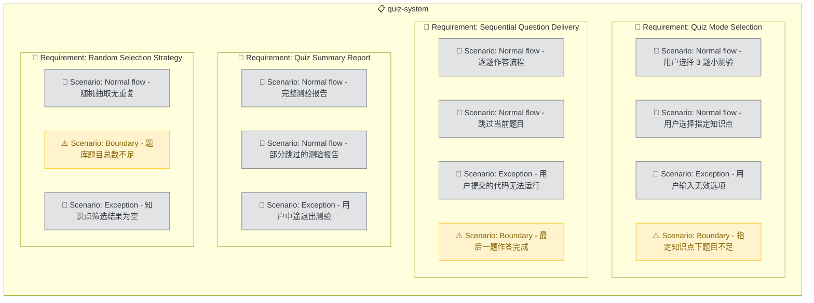

# Quiz System

## Purpose

提供随机测验系统，支持用户以聊天式交互选择测验模式（1 题快速练手、3 题小测验、5 题模拟赛）。系统从内置题库中随机抽取指定数量的题目，逐题展示 ACM 格式题面，等待用户作答后调用评判引擎评分，最终汇总报告。用户可选指定知识点分类进行专项训练。测验系统是用户日常训练的主要入口，直接影响训练体验的流畅度和趣味性。

<!-- DIAGRAM:flowchart -->

## Requirements

### Requirement: Quiz Mode Selection
系统 SHALL 在用户触发 `/acm quiz` 时，以聊天式问答交互展示可选的测验模式（1 题 / 3 题 / 5 题）和可选的知识点分类筛选。用户通过文字回复即可完成选择。系统 MUST 提供清晰的选项列表和引导提示，并在用户输入无效选项时重新提示。

#### Scenario: Normal flow - 用户选择 3 题小测验
Given 用户输入 `/acm quiz`
When Skill 展示选项列表（1题/3题/5题 + 知识点筛选）
And 用户回复"3"
Then 系统从题库随机抽取 3 道题，进入逐题作答模式

#### Scenario: Normal flow - 用户选择指定知识点
Given 用户输入 `/acm quiz`
When Skill 展示选项列表
And 用户回复"3"并指定知识点"动态规划"
Then 系统从"动态规划"标签的题库中随机抽取 3 道题

#### Scenario: Exception - 用户输入无效选项
Given 用户输入 `/acm quiz`
When Skill 展示选项列表
And 用户回复"abc"（无效输入）
Then 系统提示"请输入有效选项（1/3/5）"，重新展示选项列表

#### Scenario: Boundary - 指定知识点下题目不足
Given 用户选择 5 题模拟赛并指定知识点"图论"，但图论标签下只有 3 道题
When 系统尝试抽取 5 道题
Then 提示"图论分类下仅有 3 道题，是否全部出题或更换分类？"，等待用户决策

### Requirement: Sequential Question Delivery
系统 SHALL 在测验模式下逐题展示题目。每道题展示完整的 ACM 格式题面（输入格式、输出格式、样例、数据范围），并等待用户粘贴代码提交。用户提交代码后，系统调用评判引擎对该题评分，展示该题的评判报告（AC/WA 评分），然后自动进入下一题。

#### Scenario: Normal flow - 逐题作答流程
Given 系统已抽取 3 道题，当前为第 1 题
When Skill 展示第 1 题题面
And 用户粘贴代码并输入 `/acm judge`
Then 系统调用评判引擎评分，展示第 1 题评判报告，然后自动展示第 2 题题面

#### Scenario: Normal flow - 跳过当前题目
Given 当前为第 2 题（共 3 题）
When 用户回复"跳过"或"skip"
Then 系统标记该题为"未作答"，直接展示第 3 题题面

#### Scenario: Exception - 用户提交的代码无法运行
Given 当前为第 1 题
When 用户粘贴的代码有语法错误（如缩进错误）
Then 评判引擎返回 CE（编译错误），系统展示错误信息，允许用户修改后重新提交或跳过

#### Scenario: Boundary - 最后一题作答完成
Given 当前为第 3 题（最后一题）
When 用户提交代码并完成评判
Then 系统汇总全部 3 题的成绩报告，不再展示下一题

### Requirement: Quiz Summary Report
系统 SHALL 在所有题目作答完成后（或用户主动结束测验时），生成测验总结报告。报告 MUST 包含：总题数、通过题数、总分、每题的判定结果和得分、用时统计（可选）。系统 SHALL 根据测验表现给出简要评价和薄弱知识点建议。

#### Scenario: Normal flow - 完整测验报告
Given 用户完成 3 题测验（2 题 AC、1 题 WA）
When 系统生成总结报告
Then 报告显示：总分 67/100，通过 2/3，逐题判定详情，以及"建议加强双指针类型题目"的评价

#### Scenario: Normal flow - 部分跳过的测验报告
Given 用户完成 5 题测验（3 题作答其中 2 题 AC、2 题跳过）
When 系统生成总结报告
Then 报告显示：总分 40/100，作答 3/5（跳过 2 题），通过 2/3，跳过的题目列出题号和名称

#### Scenario: Exception - 用户中途退出测验
Given 用户正在作答第 2 题（共 5 题），主动说"结束测验"
When 系统收到退出指令
Then 生成已作答题目的部分报告，标注"测验未完成"，提示可随时重新开始

### Requirement: Random Selection Strategy
系统 SHALL 从题库中随机抽取题目，MUST 保证同一轮测验中不出现重复题目。随机抽取 SHALL 支持按知识点标签筛选。系统 SHOULD 优先选择用户未做过的题目，在未做过题目不足时再从已做题目中选取。

#### Scenario: Normal flow - 随机抽取无重复
Given 题库有 100 道题
When 系统抽取 5 道题
Then 5 道题互不重复，且均为有效题目

#### Scenario: Boundary - 题库题目总数不足
Given 题库仅有 2 道题
When 用户请求 5 题模拟赛
Then 系统抽取全部 2 道题，提示"题库仅有 2 题，本轮出 2 题"

#### Scenario: Exception - 知识点筛选结果为空
Given 用户指定知识点"分治法"，但题库中无该标签题目
When 系统尝试抽取
Then 提示"未找到分治法相关题目"并列出可用知识点列表
